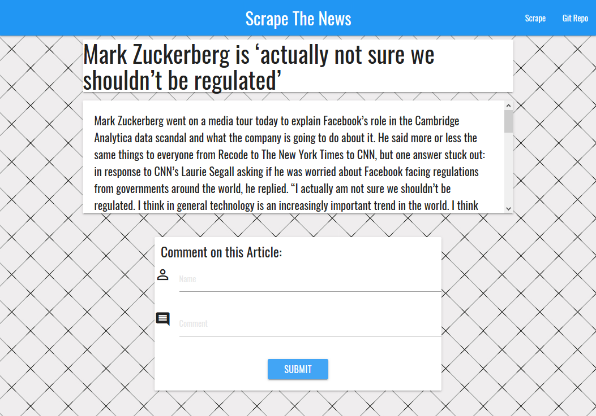
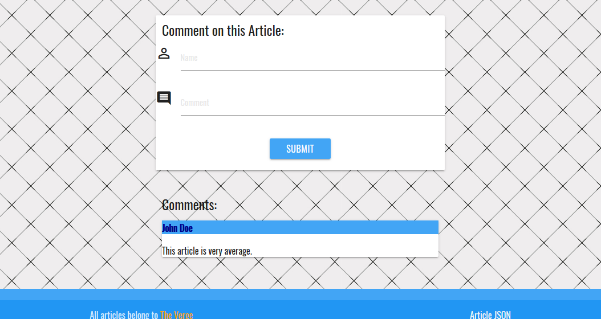

# News Scraper

Created during mod-18 of the University of Denver's full-stack web dev bootcamp. This app uses Cheerio to scrape news articles from a site and allows the user to make comments and delete them. Uses a Mongo databse and Mongoose to store comments and articles.

## Getting Started
https://#/

## Screen Shots


Scraped news articles from The Verge


Article page to read each article


Add comments by filling in the form

## Technologies used
- Node.js
- Handlebars - http://handlebarsjs.com/
- MongoDB - https://www.mongodb.com/download-center#community
- Mongoose - http://mongoosejs.com/docs/
- express NPM Package - https://www.npmjs.com/package/express
- express-handlebars NPM Package - https://www.npmjs.com/package/express-handlebars
- cheerio NPM Package - https://www.npmjs.com/package/cheerio
- body-parser NPM Package - https://www.npmjs.com/package/body-parser
- morgan NPM Package - https://www.npmjs.com/package/morgan
- request NPM Package - https://www.npmjs.com/package/request

### Prerequisites

```
- Node.js - Download the latest version of Node https://nodejs.org/en/
- Materialize - Add CDN link http://materializecss.com/getting-started.html
```

## Built With

* Sublime Text - Text Editor
* Node
* Mongoose/MongoDB
* Robomongo - Download the latest version https://robomongo.org/
* Materialize - Wireframe

## Authors

* **Jeffrey Phelps** - Full Stack Developer - [Jeffrey Phelps](https://github.com/JeffreyPhelps)
